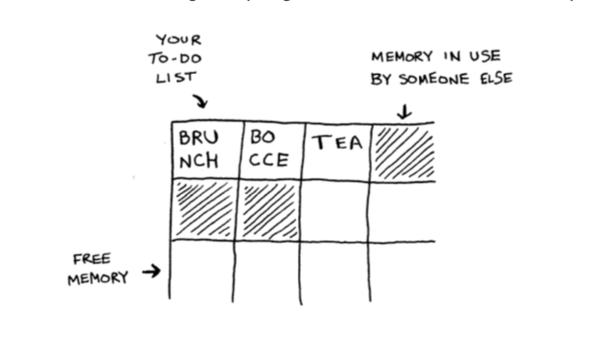
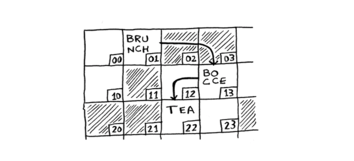
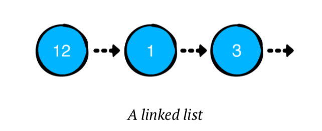

# Linked List

## Goals
- Understand what's a Linked List
- Arrays vs. Lists


## Lesson 

## What's a Linked List?

### Storing Data Sequentially

A Linked List is the most fundemental data structure you can make. One of the first problems you probably encountered as a programmer: how do I store a collection of data? Like a group of fruits, or To-Dos for your tasks. This is when you were introduced you to Arrays.

### Arrays

Arrays in Javascript is your swiss army knife. It can pretty much do anything.

Arrays in most low level languages is a very primitive collection. In languages like C++ you need to provide a location in memory for every variable. Each time you want to store an item in memory, you ask the computer for some space, and it gives you an address where you can store your item.



So as you can see, you can't store any more data after you reach 3 elements. This isn't very versatile. We need to be able to *GROW* and *SHRINK* our collection. 

That is where Linked Lists come in.

### Linked Lists

Now what if we wanted to add elements to our  list and we are not sure how many elements there will be. At one point there could be none and at another point there could be 1,000. 

This is where the 'Linked' in Linked Lists comes in. We can coordinate a sequential list by *POINTING* from one space in memory to the next. 



This chain of memory is the foundation of the simplest abstract data structure. 

```javascript
12 -> 1 -> 3 -> null
```



### Nodes

A node is the building block of a Linked List. Each 'element' is a node. A node is an Abstract Class that does two things:

1. Store information
2. Hold reference to the next Node

By doing so, you can chain nodes one after another and form a Linked Data Structure. 

```javascript
class Node {

  constructor(value) {
    // We want to initialize a Node with a value
    this.value = value;
    // An independent node shouldn't point to anything by default
    this.next = null;
  }

}
```

Now we have this object that we can initialize easily and pass in a value to store. 

Let's try chaining them:

```javascript 
let node1 = new Node(1);
// 1 -> null
let node2 = new Node(2);
// 2 -> null
let node3 = new Node(3);
// 3 -> null
```

Now we have three nodes, but they aren't connected or chained together. How do we fix this?

```javascript
let node1 = new Node(1);
let node2 = new Node(2);
let node3 = new Node(3);

node1.next = node2; // 1 -> 2 -> null

node2.next = node3; // 1 -> 2 -> 3 -> null
```

Cool, now that we manually chained the Nodes together, we finally have a Linked List right? Eh, kind of. This is actually pretty tedious to do. We have to manually create and attach the Nodes in the order we want. This is not the proper way to create an [Abstract Data Structure](https://github.com/mmosayed/DSA-Curriculum/blob/master/Abstract%20Data%20Structures/lesson-js.md). We only want to focus on the high level and have the Linked List manage it's own Nodes.

## Linked List Implementation

### Container Class

The whole purpose of an [Abstract Data Structure](https://github.com/mmosayed/DSA-Curriculum/blob/master/Abstract%20Data%20Structures/lesson-js.md) is to provide us with an interface. 

We want our 'Linked List' class to be able to do the following: 

1. Hold a reference to the beginning or 'Head' of the list
2. Be able to add onto the list new Nodes
3. Keep track of how many elements/nodes we have
4. Traverse and find elements/nodes in the list

Let's begin with defining our container class: 

```javascript 
class LinkedList {

  constructor() {
    this.head = null;
    this.tail = null;
    this.length = 0;
  }

}
```

Essentially we want the container class to contain three properties: head, tail and length. 

**Head:** This points to the first Node in the list at all times. Once we are connected to the first Node, you can find every subsequent Node. 

**Tail:** This points to the last Node at all times. Allows us to push new Nodes to the end of the list in O(1) time.

**Length:** This will be a simple Number value to keep track of the number of Nodes in the list. Think of this as an accountant.

### Linked List Methods

1. **push(value) :** Add new element to the beginning of the list. While pushing everything down.

2. **append(value) :** Add new element to the end of the list. Keeping original order intact. 

3. **print() :** Prints all the elements in the list sequentially.

4. **nodeAt(index) :** Returns value at the passed index.

5. **pop() :** Removes the last element in the list and returns it.

There are many more methods we could potentially integrate, but these 5 should give us a fully functional Linked List and teach us the ropes!

### push(value)

Adding a value at the front of the list is known as a push operation. This is also known as a head-first insertion. Because we have a Head pointer at all times this is extremely simple!

```javascript
push(value) {

  // Create a new node and assign value
  let newNode = new Node(value);

  // Assign the current head to come after the new Node
  newNode.next = this.head;

  // Assign the new Head to be the new Node you created
  this.head = newNode;

  // If there is no tail yet let's make new Node a tail.
  if (!this.tail) {
    this.tail = newNode;
  }

  this.length++;

}
```

 ### append(value) 

 The next operation we’ll look at is append. This is meant to add a value to the end of the list. This is known as tail-end insertion. This is also pretty easy and straight forward because we have a Tail pointer!

 ```javascript
append(value) {
  const newNode = new Node(value);

  // If there is no head yet let's make new node our head AND tail
  if (!this.head) {
    this.head = newNode;
    this.tail = newNode;
    return;
  }

  // Else continue ...

  // Attach new node to the end of linked list
  this.tail.next = newNode;
  // Then make that the new Tail
  this.tail = newNode;

  this.length++;
}
```

### print()

Let's say we want to print the list like the following: 

```
-> 1 -> 2 -> 3 -> null
```

What is our approach? We need to actually go through each Node one by one and print right? Correct. This is called **traversal**. Traversing through a linked list and other linked data structures is very important.

```javascript 
print() {
  // Lets create a string to add onto 
  let display = "-> ";
  // We need a pointer variable that will start in the head and work its way down
  let pointer = this.head;
  
  // Keep traversing to the next aslong as pointer isn't null
  while(pointer !== null) {
    // Update display string 
    display += pointer.value + " -> ";
    // Update pointer to the next Node
    pointer = pointer.next;
  }
    
  // Display result
  console.log(display);    

}
```

### nodeAt(index)

Lets say we want the following indexes:

```javascript
// -> Apple -> Orange -> Lemon -> null

fruits.nodeAt(0); // Apple
fruits.nodeAt(2); // Lemon
```

How would we go on about doing this? We need to traverse through the list like the previous example, but this time we stop at a counter. 

```javascript 
nodeAt(index) {
  let counter = 0;
  let pointer = this.head;

  while(counter < index) {
    pointer = pointer.next;
    counter++;
  }

  return pointer;
}
```

This is fairly similiar to the previous traversal example. In this case we start with the 'Head', which happens to be 'Zero' index, then work our way down the nodes as long as the counter isn't matching the index we are searching for. 

Finally, when we do arrive at the index, we return the Node to the user. Where they can easily access the value or any associated pointers. 

### pop() 

Finally, we have pop(). We want to be able to remove the last element of the list and get back that Node once the operation is done. 

How would we approach this?
1. Check if the head is the tail. Why? That means there is only one Node in the list and we have both of our Head and Tail pointers to it.
2. If not, then we need to traverse down the list and be able to identify the last and second to last elements.

```javascript
pop() {
  const deletedTail = this.tail;

  if (this.head === this.tail) {
    // There is only one node in linked list.
    this.head = null;
    this.tail = null;
    this.length--;
    return deletedTail;
  }

  // If there are many nodes in linked list...

  // Rewind to the last node and delete "next" link for the node before the last one.
  let currentNode = this.head;
  while (currentNode.next) {
    if (!currentNode.next.next) {
      currentNode.next = null;
    } else {
      currentNode = currentNode.next;
    }
  }

  this.tail = currentNode;

  this.length--;
  return deletedTail;
}
```

So, as you can see being able to properly traverse down a linked data structure is crucial. You will use this same traversal techniques for more advanced data structures.

## Exercise

Implement the following Linked List Methods:

1. **shift() :** Remove the first element from the beginning of the list. Return the removed node.
2. **removeAt(index) :** Remove the element at the index provided. Return the removed node.
3. **find(value) :** Find and return the index of the node with passed value. If value doesn't exist in the list return -1. 
4. **toArray() :** Returns an array with the values of the linked list.

